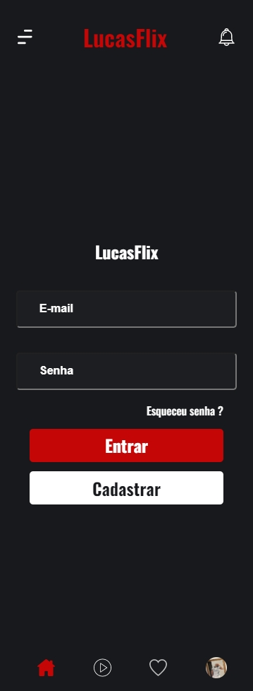
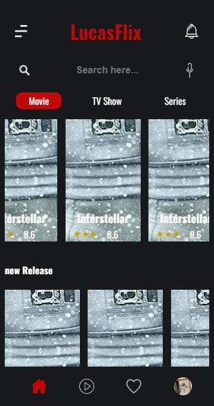
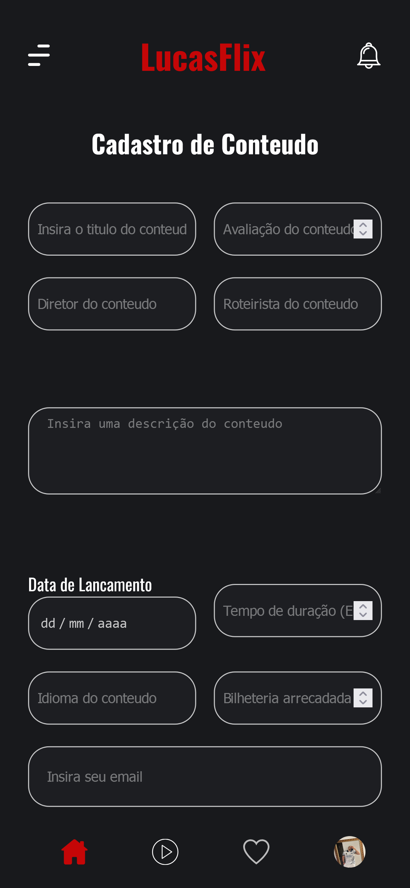

## Projeto em que esta contido o Frontend da Aplicação. Projeto da materia de Desenvolvimento Web com Professor João.

|Alunos   |   |RA   |
|---|---|---|
|Lucas Silva de Jesus   |   |202104644604   |
|Leonardo Paublo de Oliveira   |   |202102074096   |
|Richard de Souza Leite   |   |202051599481   |

### Figma:
- https://www.figma.com/file/SQAOoA60TiZ65SAKhhc8rT/Projeto-da-Faculdade?node-id=0%3A1

### Instalação das dependencias necessarias:  
`npm install ou npm i`  
Após a instalação dos pacotes necessarios, pelo terminal acesse a pasta `mock`
com o comando:  
`cd ./mock/`  Instale as dependencias da mesma. (`npm install`)

###  Para execução local da aplicação basta na raiz do proejeto rodar os seguintes comandos:
 `npm run start` na raiz do projeto e também na pasta `mock`.

### Navgação na aplicação
Após aplicação rodando, você será direcionado para a pagina `/home`.
Nesta ficará apresentação dos conteudos que ficará sendo exibido para os clientes.
Esta pagina como todas as outras contam com o footer e o header.

No footer, você terá uma navegação dentro da aplicação.
Clicando no Icone da casinha(home), você será direcionado para o `/home`
Clicando no icone de Play(segundo icone da esquerda para direita) será direcionado para a pagina de inclusão de conteudo `cadastrar/conteudo`.
Clicando no icone de Favorito(terceiro icone da esquerda para direita) até o momento não criado seu direcionamento.
Clicando no icone com a imagem que será dinamica assim que juntarmos ao backend, será direcionado para a pagina do perfil.

Na pagina de perfil, caso clique em Sair, será direcionado para a tela de login `/login`.
Na tela de login caso, clique em entrar será direcionado para a home. Caso clique em cadastrar será direcionado para a pagina de cadastro de cliente `cadastrar/cliente`

Algumas funcionalidades ainda não foram totalmente desenvolvidas mas já estão mapeadas para serem implementadas, como: Filtro, busca, inclusao de conteudo, inclusao de cliente e validação de login.

### Deploy do frontend: 
Deploy da parte de frontend que foi desenvolvido em angular, está deployada na [Vercel](https://vercel.com/).
Podendo ser acessada a partir da [URL](https://desweb-eight.vercel.app/)

### Deploy da Mock:
Deploy da mock que foi desenvolvida para simular um backend em nodejs está deployado na [Render](https://render.com/).
Podendo ser acessada a partir da [URL](https://mock-vjcb.onrender.com/)
Com acesso liberado apenas para URL mapeadas.

###  A seguinte temos algumas imagens das aplicação funcionando com a mock em pé:

Tela de Login Mobile

Tela de Home Mobile

Tela de Cadastro de Conteudo Mobile

